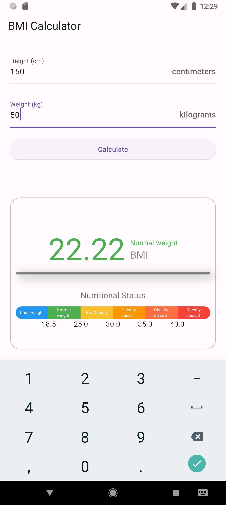

### Struktur Aplikasi

1. **Imports**:
   - `dart:math` untuk kalkulasi matematika.
   - `flutter/material.dart` untuk membangun antarmuka pengguna.

2. **Kelas MainPage**:
   - Kelas utama `MainPage` adalah `StatefulWidget`, artinya UI dapat berubah berdasarkan perubahan state.
   - Kelas `_MainPageState` menyimpan state dan membangun UI.

### Properti `_MainPageState`

- **Controllers**:
  - `_heightController` dan `_weightController` digunakan untuk mengambil input tinggi dan berat badan dari pengguna.

- **Variabel**:
  - `bmi` untuk menyimpan nilai BMI yang dihitung.
  - `errorText` untuk menyimpan pesan kesalahan jika input tidak valid.
  - `status` untuk menyimpan status gizi berdasarkan nilai BMI.

### Metode `calculateBMI()`

1. Mengambil input tinggi dan berat badan.
2. Memeriksa apakah input valid (tidak null dan positif).
3. Menghitung BMI menggunakan rumus: `BMI = berat / (tinggi/100)^2`.
4. Menentukan status gizi berdasarkan nilai BMI:
   - < 18.5: Underweight
   - 18.5 - 24.9: Normal weight
   - 25 - 29.9: Pre-Obesity
   - 30 - 34.9: Obesity class 1
   - 35 - 39.9: Obesity class 2
   - ≥ 40: Obesity class 3

### Metode `build(BuildContext context)`

Membangun antarmuka pengguna dengan struktur berikut:

1. **AppBar**: Menampilkan judul "BMI Calculator".
2. **TextFields**: Dua `TextField` untuk input tinggi (cm) dan berat (kg).
3. **Button**: `ElevatedButton` untuk memicu kalkulasi BMI.
4. **Error Text**: Menampilkan pesan kesalahan jika ada.
5. **BMI Display**:
   - Menampilkan nilai BMI yang dihitung.
   - Mengubah warna teks berdasarkan status gizi.
6. **Nutritional Status Bar**: Menampilkan bar warna yang menunjukkan kategori status gizi (Underweight, Normal weight, Pre-Obesity, dll.).

### Penyesuaian Tambahan

Untuk memperjelas kode, metode `_getStatusColor` dapat ditambahkan untuk mengembalikan warna berdasarkan status gizi.

```dart
Color? _getStatusColor() {
  switch (status) {
    case 'Underweight':
      return Colors.blue;
    case 'Normal weight':
      return Colors.green;
    case 'Pre-Obesity':
      return Colors.yellow.shade700;
    case 'Obesity class 1':
      return Colors.orange;
    case 'Obesity class 2':
      return Colors.deepOrangeAccent;
    case 'Obesity class 3':
      return Colors.red;
    default:
      return null;
  }
}
```

Metode ini digunakan dalam widget `Text` dan `Container` untuk menentukan warna teks berdasarkan status gizi.

### Ringkasan Fungsi Utama

- **TextField**: Mengambil input tinggi dan berat badan.
- **Button**: Memicu perhitungan BMI.
- **BMI Display**: Menampilkan hasil BMI dan status gizi dengan warna yang sesuai.
- **Nutritional Status Bar**: Visualisasi kategori status gizi.

Dengan struktur ini, aplikasi dapat menghitung BMI berdasarkan input pengguna dan memberikan informasi tentang status gizi mereka.